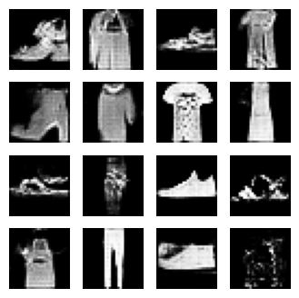

# Назарова Дарья
## Лабораторная работа №7


```python
import tensorflow as tf
# для создания и обучения нейронных сетей

from tensorflow.keras import layers, models, optimizers, metrics, callbacks  # Импорт модулей из Keras
# - layers: для создания слоев нейронной сети,
# - models: для определения архитектуры модели,
# - optimizers: для выбора алгоритма оптимизации,
# - metrics: для оценки производительности модели,
# - callbacks: для добавления функциональности обратного вызова во время обучения модели.

import numpy as np  #  для работы с многомерными массивами, матрицами, математическими функциями.

import matplotlib.pyplot as plt  # для создания графиков

```


```python
(train_images, _), (_, _) = tf.keras.datasets.fashion_mnist.load_data()
# набор данных из изображений одежды.
# беру обучающие изображения (train_images)

train_images = (train_images.astype("float32") - 127.5) / 127.5
# преобразование типа данных изображений в float32
# нормализуею значения пикселей из диапазона [0, 255] в диапазон [-1, 1]
# для улучшения сходимости модели во время обучения

train_images = np.expand_dims(train_images, axis=-1)
# дополнительное измерение к массиву изображений

batch_size = 64  # размер батча для обучения модели

train_dataset = (
    tf.data.Dataset.from_tensor_slices(train_images)  # объект из тензоров изображений
    .shuffle(60000)
    .batch(batch_size)  # деление данных на батчи заданного размера
)
```


```python
def build_generator(latent_dim):  # функция для создания генератора
    model = models.Sequential([  # последовательная модель, из нескольких слоев
        layers.Dense(7 * 7 * 256, use_bias=False, input_dim=latent_dim),
        # полносвязный слой с 7 * 7 * 256 нейронами
        # use_bias=False указывает, что смещение не будет использоваться в этом слое

        layers.BatchNormalization(),  # нормализация батча для улучшения стабильности и ускорения обучения
        layers.LeakyReLU(),  # Leaky ReLU позволяет пропускать отрицательные значения

        layers.Reshape((7, 7, 256)),

        layers.Conv2DTranspose(128, (5, 5), strides=(1, 1), padding="same", use_bias=False),
        # транспонированный свертка с 128 фильтрами и размером ядра (5, 5)
        # strides=(1, 1) и padding="same" обеспечивает сохранение пространственного размера

        layers.BatchNormalization(), # нормализация батча для улучшения обучения
        layers.LeakyReLU(),

        layers.Conv2DTranspose(64, (5, 5), strides=(2, 2), padding="same", use_bias=False),
        # транспонированный сверток с 64 фильтрами, увеличивая размер выходного изображения в два раза (strides=(2, 2))

        layers.BatchNormalization(),  # нормализация батча
        layers.LeakyReLU(),

        layers.Conv2DTranspose(1, (5, 5), strides=(2, 2), padding="same", activation="tanh")
    ])
    return model

```


```python
def build_critic():  # функция для создания критика (дискриминатора)
    model = models.Sequential([  # последовательная модель из нескольких слоев
        layers.Conv2D(64, (5, 5), strides=(2, 2), padding="same", input_shape=[28, 28, 1]),
        # Добавляем свертку (Conv2D) с 64 фильтрами и размером ядра (5, 5)
        # Параметры strides=(2, 2) уменьшают размер выходного изображения вдвое
        # padding="same" сохраняет пространственный размер. Указываем входную форму [28, 28, 1] для черно-белых изображений

        layers.LeakyReLU(),  # Используем активационную функцию Leaky ReLU для введения нелинейности в модель.
        layers.Dropout(0.3),  # Применяем слой Dropout с вероятностью 0.3 для регуляризации и предотвращения переобучения.

        layers.Conv2D(128, (5, 5), strides=(2, 2), padding="same"),
        # Добавляем еще одну свертку с 128 фильтрами, которая также уменьшает размер выходного изображения.

        layers.LeakyReLU(),  # Снова используем Leaky ReLU как активационную функцию.
        layers.Dropout(0.3),  # Применяем Dropout для регуляризации.

        layers.Flatten(), # Преобразуем 3D-тензор (изображение) в 1D-вектор, чтобы подготовить данные для полносвязного слоя.

        layers.Dense(1),  # Добавляем полносвязный слой (Dense) с одним выходом, который будет предсказывать вероятность того, что входное изображение является реальным (из обучающего набора) или сгенерированным.
    ])
    return model  # Возвращаем построенную модель критика.

```


```python
class WGANGP(models.Model):  # класс WGANGP наследует от модели Keras
    def __init__(self, critic, generator, latent_dim, critic_steps=5, gp_weight=10):
        super(WGANGP, self).__init__()  # конструктор родительского класса
        self.critic = critic  # Сохраняем модель
        self.generator = generator
        self.latent_dim = latent_dim
        self.critic_steps = critic_steps
        self.gp_weight = gp_weight

    def compile(self, c_optimizer, g_optimizer):
        super(WGANGP, self).compile()  # метод compile родительского класса
        self.c_optimizer = c_optimizer  # оптимизатор для критика
        self.g_optimizer = g_optimizer  # оптимизатор для генератора
        self.c_loss_metric = metrics.Mean(name="c_loss")  # метрика для потерь
        self.g_loss_metric = metrics.Mean(name="g_loss")

    def gradient_penalty(self, real_images, fake_images):
        alpha = tf.random.normal([tf.shape(real_images)[0], 1, 1, 1], 0.0, 1.0)  # случайные альфа-коэффициенты
        interpolated = real_images + alpha * (fake_images - real_images)  # интерполированные изображения
        with tf.GradientTape() as tape:  # контекст для записи градиентов
            tape.watch(interpolated)  # интерполированные изображения
            pred = self.critic(interpolated)  # предсказания для интерполированных изображений
        grads = tape.gradient(pred, [interpolated])[0]  # градиенты предсказаний по интерполированным изображениям.
        norm = tf.sqrt(tf.reduce_sum(tf.square(grads), axis=[1, 2, 3]))  # норма градиентов
        return tf.reduce_mean((norm - 1.0) ** 2)  # среднее значение штрафа за градиенты

    def train_step(self, real_images):
        batch_size = tf.shape(real_images)[0]  # размер батча из реальных изображений

        for _ in range(self.critic_steps):  # .
            random_latent_vectors = tf.random.normal([batch_size, self.latent_dim])  # случайные латентные векторы
            with tf.GradientTape() as tape:  # контекст для записи градиентов
                fake_images = self.generator(random_latent_vectors)  # фейковые изображения
                fake_pred = self.critic(fake_images)  # предсказания для фейковых изображений
                real_pred = self.critic(real_images)  # предсказания для реальных изображений
                wass_loss = tf.reduce_mean(fake_pred) - tf.reduce_mean(real_pred)  # Вычисляем потери
                gp = self.gradient_penalty(real_images, fake_images)  # градиентный штраф
                c_loss = wass_loss + gp * self.gp_weight  # Общие потери
            grads = tape.gradient(c_loss, self.critic.trainable_variables)  # градиенты потерь
            self.c_optimizer.apply_gradients(zip(grads, self.critic.trainable_variables))  # обновление параметры

        random_latent_vectors = tf.random.normal([batch_size, self.latent_dim])  # случайные латентные векторы
        with tf.GradientTape() as tape:  # контекст для записи градиентов
            fake_images = self.generator(random_latent_vectors)  # фейковые изображения
            fake_pred = self.critic(fake_images)  # предсказания для фейковых изображений.
            g_loss = -tf.reduce_mean(fake_pred)  # потери генератора
        grads = tape.gradient(g_loss, self.generator.trainable_variables)  # градиенты потерь генератора
        self.g_optimizer.apply_gradients(zip(grads, self.generator.trainable_variables))  # обновление параметры

        self.c_loss_metric.update_state(c_loss)  # метрики потерь критика
        self.g_loss_metric.update_state(g_loss)  # метрики потерь генератора
        return {"c_loss": self.c_loss_metric.result(), "g_loss": self.g_loss_metric.result()}

```


```python
latent_dim = 100  # Размерность латентного пространства

# генератор с заданной размерностью латентного пространства
generator = build_generator(latent_dim)  #  build_generator возвращает модель генератора

# Создание критика
critic = build_critic()  # build_critic возвращает модель критика

# модель Wasserstein GAN с градиентным штрафом
wgan = WGANGP(critic=critic, generator=generator, latent_dim=latent_dim)

# модель с оптимизаторами для критика и генератора
wgan.compile(
    c_optimizer=optimizers.Adam(learning_rate=0.0002, beta_1=0.5, beta_2=0.9),  # Оптимизатор для критика.
    g_optimizer=optimizers.Adam(learning_rate=0.0002, beta_1=0.5, beta_2=0.9),  # Оптимизатор для генератора.
)

# обучение модели
wgan.fit(train_dataset, epochs=50)  # 50 эпох

```

    /usr/local/lib/python3.10/dist-packages/keras/src/layers/core/dense.py:87: UserWarning: Do not pass an `input_shape`/`input_dim` argument to a layer. When using Sequential models, prefer using an `Input(shape)` object as the first layer in the model instead.
      super().__init__(activity_regularizer=activity_regularizer, **kwargs)
    

    Epoch 1/50
    

    /usr/local/lib/python3.10/dist-packages/keras/src/layers/convolutional/base_conv.py:107: UserWarning: Do not pass an `input_shape`/`input_dim` argument to a layer. When using Sequential models, prefer using an `Input(shape)` object as the first layer in the model instead.
      super().__init__(activity_regularizer=activity_regularizer, **kwargs)
    

    938/938 ━━━━━━━━━━━━━━━━━━━━ 96s 81ms/step - c_loss: -8.6708 - g_loss: -8.4631
    Epoch 2/50
    938/938 ━━━━━━━━━━━━━━━━━━━━ 66s 71ms/step - c_loss: -3.2808 - g_loss: -13.2420
    Epoch 3/50
    938/938 ━━━━━━━━━━━━━━━━━━━━ 82s 71ms/step - c_loss: -2.4835 - g_loss: -8.9343
    Epoch 4/50
    938/938 ━━━━━━━━━━━━━━━━━━━━ 66s 70ms/step - c_loss: -2.2010 - g_loss: -4.8260
    Epoch 5/50
    938/938 ━━━━━━━━━━━━━━━━━━━━ 66s 70ms/step - c_loss: -2.1000 - g_loss: -5.3608
    Epoch 6/50
    938/938 ━━━━━━━━━━━━━━━━━━━━ 83s 71ms/step - c_loss: -1.9429 - g_loss: -4.9012
    Epoch 7/50
    938/938 ━━━━━━━━━━━━━━━━━━━━ 82s 71ms/step - c_loss: -1.8842 - g_loss: -2.6387
    Epoch 8/50
    938/938 ━━━━━━━━━━━━━━━━━━━━ 82s 71ms/step - c_loss: -1.8311 - g_loss: -2.1450
    Epoch 9/50
    938/938 ━━━━━━━━━━━━━━━━━━━━ 66s 70ms/step - c_loss: -1.7284 - g_loss: -2.6685
    Epoch 10/50
    938/938 ━━━━━━━━━━━━━━━━━━━━ 67s 71ms/step - c_loss: -1.6925 - g_loss: -3.4164
    Epoch 11/50
    938/938 ━━━━━━━━━━━━━━━━━━━━ 66s 71ms/step - c_loss: -1.7031 - g_loss: -1.7365
    Epoch 12/50
    938/938 ━━━━━━━━━━━━━━━━━━━━ 66s 70ms/step - c_loss: -1.6465 - g_loss: -2.9038
    Epoch 13/50
    938/938 ━━━━━━━━━━━━━━━━━━━━ 83s 71ms/step - c_loss: -1.5871 - g_loss: -1.3519
    Epoch 14/50
    938/938 ━━━━━━━━━━━━━━━━━━━━ 82s 71ms/step - c_loss: -1.5617 - g_loss: -0.6062
    Epoch 15/50
    938/938 ━━━━━━━━━━━━━━━━━━━━ 82s 71ms/step - c_loss: -1.5563 - g_loss: 0.3277
    Epoch 16/50
    938/938 ━━━━━━━━━━━━━━━━━━━━ 66s 70ms/step - c_loss: -1.5009 - g_loss: 0.0117
    Epoch 17/50
    938/938 ━━━━━━━━━━━━━━━━━━━━ 66s 70ms/step - c_loss: -1.5055 - g_loss: -0.8521
    Epoch 18/50
    938/938 ━━━━━━━━━━━━━━━━━━━━ 66s 70ms/step - c_loss: -1.4758 - g_loss: -0.5205
    Epoch 19/50
    938/938 ━━━━━━━━━━━━━━━━━━━━ 66s 70ms/step - c_loss: -1.4666 - g_loss: -0.2661
    Epoch 20/50
    938/938 ━━━━━━━━━━━━━━━━━━━━ 66s 70ms/step - c_loss: -1.4125 - g_loss: 0.3304
    Epoch 21/50
    938/938 ━━━━━━━━━━━━━━━━━━━━ 66s 71ms/step - c_loss: -1.4378 - g_loss: -0.4338
    Epoch 22/50
    938/938 ━━━━━━━━━━━━━━━━━━━━ 66s 70ms/step - c_loss: -1.3810 - g_loss: 2.7651
    Epoch 23/50
    938/938 ━━━━━━━━━━━━━━━━━━━━ 66s 70ms/step - c_loss: -1.3320 - g_loss: 2.0498
    Epoch 24/50
    938/938 ━━━━━━━━━━━━━━━━━━━━ 83s 71ms/step - c_loss: -1.3885 - g_loss: 1.3660
    Epoch 25/50
    938/938 ━━━━━━━━━━━━━━━━━━━━ 82s 71ms/step - c_loss: -1.3700 - g_loss: 0.8856
    Epoch 26/50
    938/938 ━━━━━━━━━━━━━━━━━━━━ 66s 70ms/step - c_loss: -1.3333 - g_loss: 3.3099
    Epoch 27/50
    938/938 ━━━━━━━━━━━━━━━━━━━━ 66s 70ms/step - c_loss: -1.3679 - g_loss: 5.7279
    Epoch 28/50
    938/938 ━━━━━━━━━━━━━━━━━━━━ 66s 71ms/step - c_loss: -1.3153 - g_loss: 3.6858
    Epoch 29/50
    938/938 ━━━━━━━━━━━━━━━━━━━━ 83s 71ms/step - c_loss: -1.3221 - g_loss: 3.2989
    Epoch 30/50
    938/938 ━━━━━━━━━━━━━━━━━━━━ 66s 70ms/step - c_loss: -1.3210 - g_loss: 2.3823
    Epoch 31/50
    938/938 ━━━━━━━━━━━━━━━━━━━━ 66s 70ms/step - c_loss: -1.2428 - g_loss: 1.7792
    Epoch 32/50
    938/938 ━━━━━━━━━━━━━━━━━━━━ 66s 70ms/step - c_loss: -1.2655 - g_loss: 3.5605
    Epoch 33/50
    938/938 ━━━━━━━━━━━━━━━━━━━━ 66s 71ms/step - c_loss: -1.2503 - g_loss: 3.0543
    Epoch 34/50
    938/938 ━━━━━━━━━━━━━━━━━━━━ 83s 71ms/step - c_loss: -1.2855 - g_loss: 2.9978
    Epoch 35/50
    938/938 ━━━━━━━━━━━━━━━━━━━━ 66s 70ms/step - c_loss: -1.2137 - g_loss: 1.4784
    Epoch 36/50
    938/938 ━━━━━━━━━━━━━━━━━━━━ 66s 70ms/step - c_loss: -1.2523 - g_loss: 1.6313
    Epoch 37/50
    938/938 ━━━━━━━━━━━━━━━━━━━━ 66s 70ms/step - c_loss: -1.1740 - g_loss: 1.3925
    Epoch 38/50
    938/938 ━━━━━━━━━━━━━━━━━━━━ 83s 71ms/step - c_loss: -1.1665 - g_loss: 0.8290
    Epoch 39/50
    938/938 ━━━━━━━━━━━━━━━━━━━━ 66s 70ms/step - c_loss: -1.1810 - g_loss: 2.1367
    Epoch 40/50
    938/938 ━━━━━━━━━━━━━━━━━━━━ 66s 70ms/step - c_loss: -1.2545 - g_loss: 3.7186
    Epoch 41/50
    938/938 ━━━━━━━━━━━━━━━━━━━━ 83s 71ms/step - c_loss: -1.1905 - g_loss: 2.1944
    Epoch 42/50
    938/938 ━━━━━━━━━━━━━━━━━━━━ 66s 70ms/step - c_loss: -1.1553 - g_loss: 2.1372
    Epoch 43/50
    938/938 ━━━━━━━━━━━━━━━━━━━━ 66s 70ms/step - c_loss: -1.1656 - g_loss: 1.2261
    Epoch 44/50
    938/938 ━━━━━━━━━━━━━━━━━━━━ 83s 71ms/step - c_loss: -1.1535 - g_loss: 2.3463
    Epoch 45/50
    938/938 ━━━━━━━━━━━━━━━━━━━━ 66s 70ms/step - c_loss: -1.2039 - g_loss: 3.2486
    Epoch 46/50
    938/938 ━━━━━━━━━━━━━━━━━━━━ 83s 71ms/step - c_loss: -1.1738 - g_loss: 3.4035
    Epoch 47/50
    938/938 ━━━━━━━━━━━━━━━━━━━━ 66s 70ms/step - c_loss: -1.1868 - g_loss: 5.0657
    Epoch 48/50
    938/938 ━━━━━━━━━━━━━━━━━━━━ 66s 70ms/step - c_loss: -1.1428 - g_loss: 2.4350
    Epoch 49/50
    938/938 ━━━━━━━━━━━━━━━━━━━━ 66s 71ms/step - c_loss: -1.1607 - g_loss: 3.5133
    Epoch 50/50
    938/938 ━━━━━━━━━━━━━━━━━━━━ 66s 70ms/step - c_loss: -1.1306 - g_loss: 3.8242
    


    <keras.src.callbacks.history.History at 0x78fcb305e3b0>


```python
random_latent_vectors = tf.random.normal([16, latent_dim])  # 16 случайных латентных векторов размерности latent_dim

generated_images = generator(random_latent_vectors)  # генератор для создания изображений на основе латентных векторов

# Преобразование значения изображений из диапазона [-1, 1] в [0, 255] к типу uint8
generated_images = (generated_images * 127.5 + 127.5).numpy().astype("uint8")

plt.figure(figsize=(4, 4))  # размер фигуры 4x4 дюйма
for i in range(16):
    plt.subplot(4, 4, i + 1)  # подграфик для каждого из 16 изображений
    plt.imshow(generated_images[i, :, :, 0], cmap="gray")  # изображения в градациях серого
    plt.axis("off")  # отключение осей
plt.show()
```


    

    

